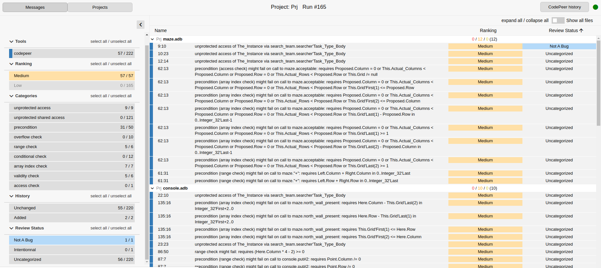

WebUI: The GNATdashboard web interface
======================================

The GNATdashboard web interface provides a web-based user interface to display, explore and manage the data gathered by GNATdashboard.
It works with CodePeer, GNATmetric and GNATcheck.

Quick Launch
------------

To launch the web interface, you first need to create the web data files statically.

Creating the data files
'''''''''''''''''''''''

* Gnathub: The creation is done by default when running Gnathub.
           If you don't want it to be created, use the :ref:`--plugins` switch.
    :code:`gnathub -P<project>`

* CodePeer: You need to use either the ``-html`` or ``-html-only`` switches:
    :code:`codepeer -P<project> -html`

    :code:`codepeer -P<project> -html-only`

Web Interface Overview
----------------------

Let's take a look at the following picture:

There are three parts in the view: Header, Filter and Content.

The Header and Filter parts are static.
The content space will change depending on your navigation.

Header
''''''

It is composed of two navigations buttons (on the left side):

* the Message Navigation button, that will lead to :ref:`Message navigation` content.
* the Project Navigation button, that will lead to :ref:`Project navigation` content.

.. _Filter:

Filter
''''''

This part is collapsible by clicking on the arrow on the upper-right of the filter span.

It will allow you to filter the messages shown in all the views, by clicking on the different span.
There are three states for a span:

* activated: the color is bright. You can deactivate it by clicking.
* deactivated: the color is transparent. You can activate it by clicking.
* No occurrence: the number on the right is a 0.

There is some color code that you will retrieve on the content page:

* the left border color representing the tool that reports the message
* the background color (red, orange, yellow, green) for the message ranking.

Content
'''''''

There are three different pages:

* Message navigation
* Project navigation
* Source view

.. _Message navigation:

Message navigation
++++++++++++++++++

This part allows you to see all the messages, grouped by files.

You can order them by clicking on the table header (Name, Ranking, Message, Review status).

.. _Project navigation:

Project navigation
++++++++++++++++++

This part allows you to see all the files, grouped by folders, grouped by project. It is a very useful view when looking at a lot of projects.

You can order them by clicking on the table header (Name, Message).

Source view
+++++++++++

This page is made of two parts:

* the source file
* the action bar

1. Source file

You can scroll through the source file.
If the annotations in CodePeer are activated, you will see them in this part.

2. Action bar

This bar is collapsible.

| You can see all the message of the current file in the ``File messages`` tab.

You can see all the messages in the ``All messages`` tab.

| The ``line`` button, allow you to order message by line.

If GNATmetric is activated, you can see them in the ``File Metric`` tab.
If there are Race condition, you can see them in the ``Race condition`` tab.

.. _View reviews:

In the ``File message`` tab you can select a message by clicking on it. This will scroll the source view to the selected line.
If there are already some manual reviews made, then you can see the history icon appear, in the rightmost column.
By clicking on it, you will see the ``User review history`` pop-up open:

.. figure:: images/history_review.png
   :align: center

Note that WebUI used to allow adding reviews, but this functionality was removed in CodePeer 23.

Features shortcut
-----------------

Filter messages
'''''''''''''''

See the :ref:`Filter` section.
