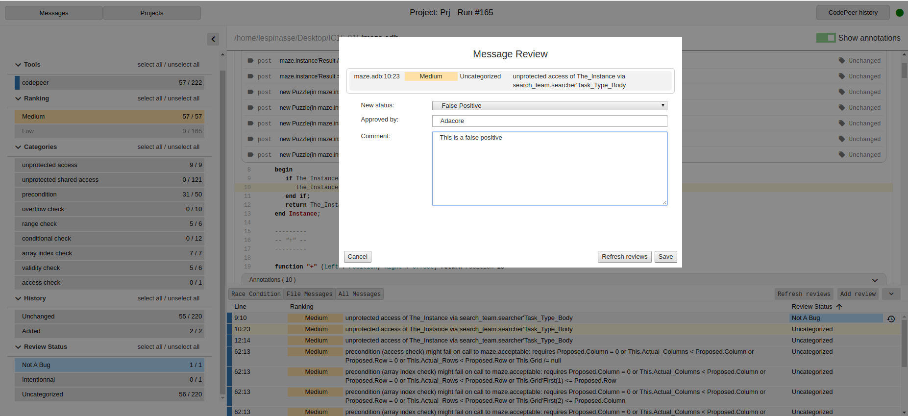

WebUI: The GNATdashboard web interface
======================================

The GNATdashboard web interface provides a web-based user interface to display, explore and manage the data gathered by GNATdashboard.
It works with CodePeer, GNATmetric and GNATcheck.

Quick Launch
------------

To launch the web interface, you first need to create the web data files statically and then launch a web server.

Creating the data files
'''''''''''''''''''''''

* Gnathub: The creation is done by default when running Gnathub.
           If you don't want it to be created, use the :ref:`--plugins` switch.
    :code:`gnathub -P<project>`

* CodePeer: You need to use either the ``-html`` or ``-html-only`` switches:
    :code:`codepeer -P<project> -html`

    :code:`codepeer -P<project> -html-only`

Serving the interface
'''''''''''''''''''''

To serve the interface, you need to launch a client webserver to render the HTML pages and an API webserver that serves the data shown by the interface.
Those two servers need to use two ports.

If not specified, the ports used by default will be 8080 and 8081.
If a <port_number> is specified, then the servers will use respectively <port_number> and <port_number+1>.

* Gnathub: You need to use the ``-server`` switch, and optionally ``-port`` to specify a port:
    :code:`gnathub -P<project> -server`

    :code:`gnathub -P<project> -server -port <port_number>`

* CodePeer: You need to add the ``--web-server`` switch, and optionally ``--port=`` to specify a port:
    :code:`codepeer -P<project> --web-server`

    :code:`codepeer -P<project> --web-server --port=<port_number>`

Please refer to the CodePeer documentation for more details and options.

Web Interface Overview
----------------------

Let's take a look at the following picture:

.. figure:: images/main.png
   :align: center

There are three parts in the view: Header, Filter and Content.

The Header and Filter parts are static.
The content space will change depending on your navigation.

Header
''''''

It is composed of two navigations buttons (on the left side):

* the Message Navigation button, that will lead to :ref:`Message navigation` content.
* the Project Navigation button, that will lead to :ref:`Project navigation` content.

On the right side, you can see a marker that tells you if the server is offline or online.
The difference between offline and online mode is the state of the API server.
If the API server is not running (e.g. API server is down or a different HTML server is used.) then the WebUI interface will be offline.
The offline mode doesn't allow you to do message review (Note: Posting review is a feature specific to CodePeer).

If you are running CodePeer, an extra button `CodePeer run id: <number>` is displayed.
This button will open a dialog displaying additional CodePeer run information.

.. _Filter:

Filter
''''''

This part is collapsible by clicking on the arrow on the upper-right of the filter span.

It will allow you to filter the messages shown in all the views, by clicking on the different span.
There are three states for a span:

* activated: the color is bright. You can deactivate it by clicking.
* deactivated: the color is crosshatched. You can activate it by clicking.
* No occurrence: the color is mostly transparent. It means that your choice of filters led to no messages of the given category.

There is some color code that you will retrieve on the content page:

* the left border color representing the tool that reports the message
* the background color (red, orange, yellow, green) for the message ranking.

Content
'''''''

There are three different pages:

* Message navigation
* Project navigation
* Source view

.. _Message navigation:

Message navigation
++++++++++++++++++

.. figure:: images/message_nav.png
   :align: center

This part allows you to see all the messages, grouped by files.

You can order them by clicking on the table header (Name, Ranking, Message).

.. _Project navigation:

Project navigation
++++++++++++++++++

.. figure:: images/project_nav.png
   :align: center

This part allows you to see all the files, grouped by folders, grouped by project. It is a very useful view when looking at a lot of projects.

You can order them by clicking on the table header (Name, Ranking, Message).

Source view
+++++++++++

.. figure:: images/source.png
   :align: center

This page is made of two parts:

* the source file
* the action bar

1. Source file

You can scroll through the source file.
If the annotations in CodePeer are activated, you will see them in this part.

2. Action bar

This bar is collapsible.

| You can see all the message of the current file in the ``File messages`` tab.

You can see all the messages in the ``All messages`` tab.

| The ``line`` button, allow you to order message by line.

If GNATmetric is activated, you can see them in the ``File Metric`` tab.

.. _Add review:

|  In the ``File message`` tab you can:

* Select a message by clicking on it (will scroll the source view to the selected line)
* Select multiple messages by using :key:``Ctrl+click`` on each message you want to select.

If you select one or more  CodePeer messages, you can review them on the interface by clicking on the ``Add review`` button.
This will open the following pop-up. Note that changing the status is mandatory:

If there are already some manual reviews made, then you can see the history icon appear.
By clicking on it, you will see the ``User review history`` pop-up open:

Features shortcut
-----------------

Filter messages
'''''''''''''''

See the :ref:`Filter` section.

User Review
'''''''''''

See the `Add review`_ section.
